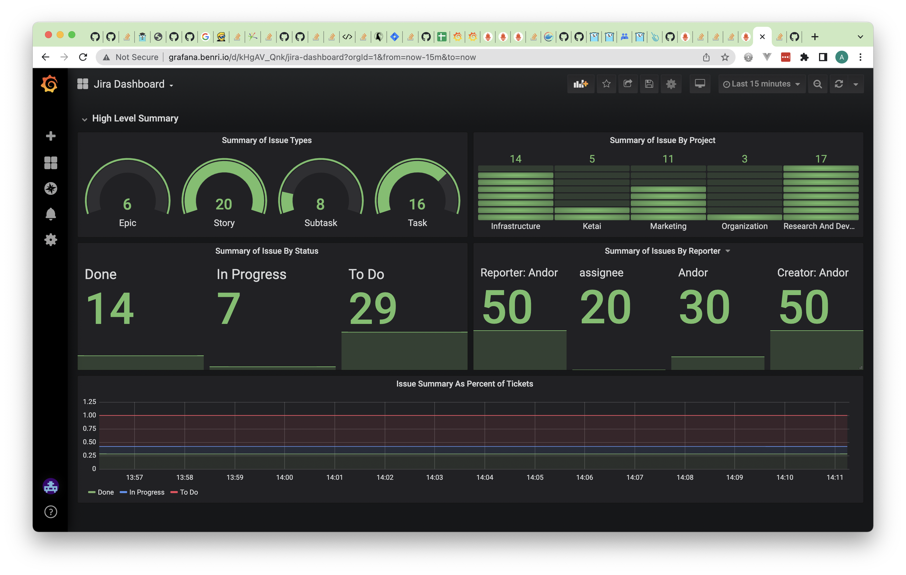

# Prometheus Jira Exporter

Exposes basic metrics for your projects from the Jira API, to a Prometheus compatible endpoint. This is a fork from https://github.com/infinityworks/github-exporter and just modified for a different use case. A lot of the core framework is the same. 

This is a *Work in Progress*. It is not yet viable. 



## Configuration

This exporter is setup to take input from environment variables. All variables are optional:

* `JIRA_API_TOKEN` If supplied, enables the user to supply a jira authentication token that allows the API to be queried more often. Optional, but recommended.
*  JIRA_USER: The Jira User 
* `JIRA_API_URL` Jira API URL. It should be https://<your-org>.atlassian.net/rest/api/3`
* `LISTEN_PORT` The port you wish to run the container on, the Dockerfile defaults this to `9171`
* `METRICS_PATH` the metrics URL path you wish to use, defaults to `/metrics`
* `LOG_LEVEL` The level of logging the exporter will run with, defaults to `debug`

## Install and deploy

## Docker compose

Make a .env file with the following fields:

```
JIRA_API_TOKEN='<token>
JIRA_API_URL='https://<domain>.atlassian.net/rest/api/3'
JIRA_USER='<user>'
```

Then a docker-compose with the following:

```
version: "2"

networks:
  benri-net:
    external:
      name: benri-net

services:
  jira-exporter:
    container_name: jira-exporter
    build: .
    tty: true
    stdin_open: true
    expose:
      - 9171
    ports:
      - 9171:9171
    env_file:
      - .env
```

## Metrics

Metrics will be made available on port 9171 by default
An example of these metrics can be found in the `METRICS.md` markdown file in the root of this repository

## Tests

There is a set of blackbox behavioural tests which validate metrics endpoint in the `test` directory. 
Run as follows

```bash
make test
```

## Version Release Procedure
Once a new pull request has been merged into `master` the following script should be executed locally. The script will trigger a new image build in docker hub with the new image having the tag `release-<version>`. The version is taken from the `VERSION` file and must follow semantic versioning. For more information see [semver.org](https://semver.org/).

Prior to running the following command ensure the number has been increased to desired version in `VERSION`: 

```bash
./release-version.sh
```
